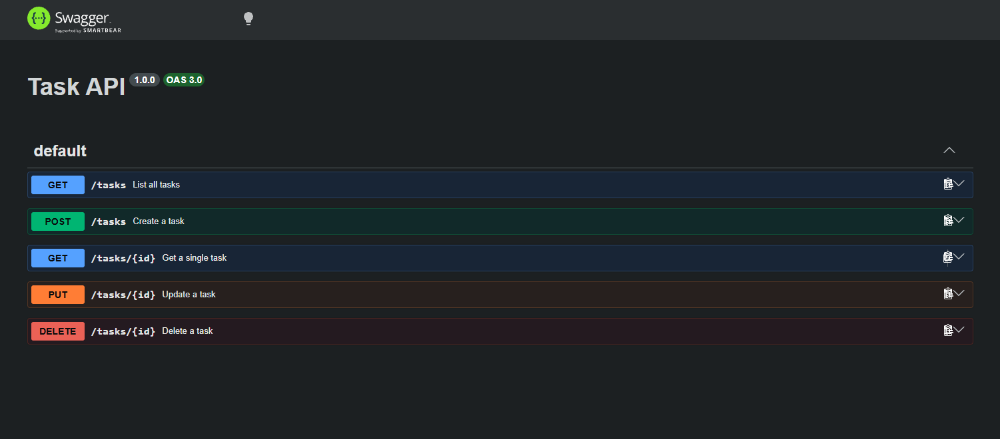
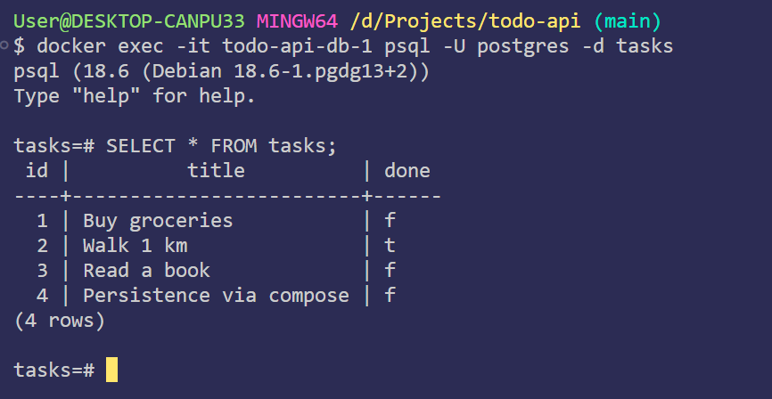

# Task API

A small **CRUD API** built with Node.js and Express. It manages a to-do list, you can create, read, update, and delete tasks. Data is stored in a **PostgreSQL** database running in Docker, so it persists across restarts.

## How to run

```bash
git clone https://github.com/tawchifulislam/todo-api.git
cd todo-api
cp .env.example .env
docker compose up
```

The API will be available at `http://localhost:3001`. Postgres and the app both start together, and a `tasks` table with 3 example tasks is created automatically on first run.

## Endpoints

| Method | Path | Description |
| --- | --- | --- |
| GET | `/` | API name and list of endpoints |
| GET | `/health` | Health check - confirms the server is running |
| GET | `/tasks` | List all tasks |
| GET | `/tasks/:id` | Get a single task |
| POST | `/tasks` | Create a new task |
| PUT | `/tasks/:id` | Update a task (title and/or done) |
| DELETE | `/tasks/:id` | Delete a task |

## Status codes

| Code | When |
| --- | --- |
| 200 | Successful GET / PUT |
| 201 | Task successfully created (POST) |
| 204 | Task successfully deleted |
| 400 | Invalid or incomplete request body |
| 404 | Task id not found |

## Example

```console
$ curl -i -X POST http://localhost:3001/tasks -H "Content-Type: application/json" -d '{"title":"Persistence via compose"}'
HTTP/1.1 201 Created
X-Powered-By: Express
Content-Type: application/json; charset=utf-8
Content-Length: 55

{"id":4,"title":"Persistence via compose","done":false}
```

## Swagger UI

With the app running, visit `http://localhost:3001/docs` to view and test all endpoints interactively via "Try it out".



## Database

This project runs **PostgreSQL in a Docker container**, replacing the SQLite file used in an earlier version of this project. Data persists in a Docker volume, so it survives both app restarts and full `docker compose down` / `up` cycles.

- Connection is configured via `DATABASE_URL` in `.env` (gitignored). `.env.example` shows the required keys with placeholder values.
- The `tasks` table is created automatically if it doesn't already exist, and 3 example tasks are seeded only if the table is empty.
- Postgres data is stored in a named Docker volume (`taskdata`), independent of the container's lifecycle, so removing and recreating the containers doesn't lose data.
- The app and database run as two services (`api` and `db`) defined in `compose.yaml`, started together with a single `docker compose up`.

### Why PostgreSQL in Docker

Postgres runs as its own server process instead of living in a single file, matching how most real backends store data. Docker means no manual installation, and the same setup runs identically on any machine.

### Example SQL query

```sql
SELECT * FROM tasks WHERE done = true;
```

### Database screenshot



## Notes

- Data now lives in a containerized PostgreSQL database instead of SQLite or an in-memory array. A full `docker compose down` followed by `up` was tested and confirmed the data survives.
- This project has gone through three storage backends as part of a learning track: an in-memory array, then SQLite, then this containerized Postgres setup. The API's routes and behavior stayed the same throughout; only the storage layer changed.

## AI vs Me

I hand-built the API in `index.js` (Stages 0-6). For Stage 7, I gave an AI the same starting code and asked it to rewrite it in a better way, with the same features. Its version is in `ai-version/`.

**Prompt used:**
> Use node and express make a simple crud for todo-api. use as a example i write down in this chat, make this code far more better way. and data will be in-memory. and i also need swagger ui for try it out. index.js, openapi.json i need this two file. [+ my Stage 0-6 code]

**What the AI did better:**

- Pulled repeated "find task or return 404" logic into one helper function (`findTaskOrFail`) instead of repeating the same code in every route.
- Used a `nextId` counter for new task ids instead of recalculating the max id every time.

**What it changed or added without being asked:**

- Added a catch-all 404 handler for unknown routes, I never asked for this in my prompt.
- Changed `const tasks` to `let tasks`, not necessary for how the array is used, since only `.push()`/`.splice()` are called.

**What my prompt didn't specify:**

- I didn't mention exact error messages, so the AI kept mine as-is (since I gave it my code as an example) instead of inventing its own wording.
- I didn't specify how to generate new ids, so it chose a counter variable instead of my `Math.max(...)` approach.

**One-sentence takeaway:** A more detailed prompt (naming the id-generation rule and saying "no extra routes") would have made the AI's output match mine more closely.
