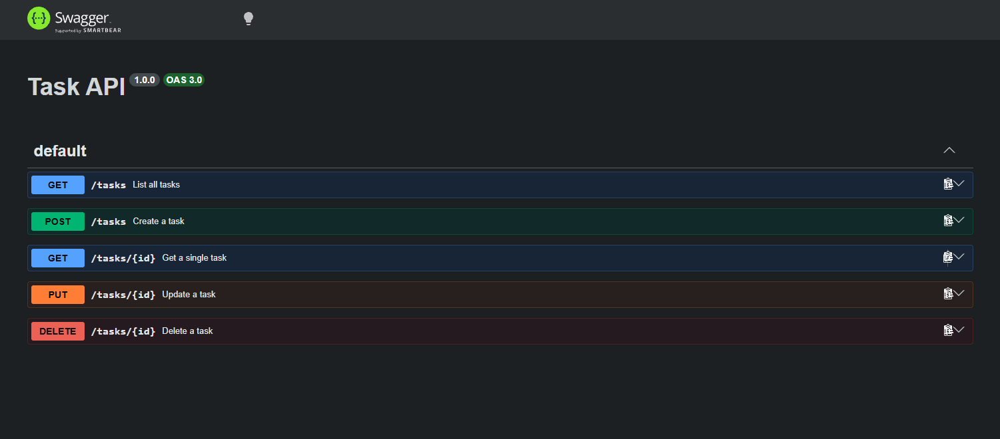
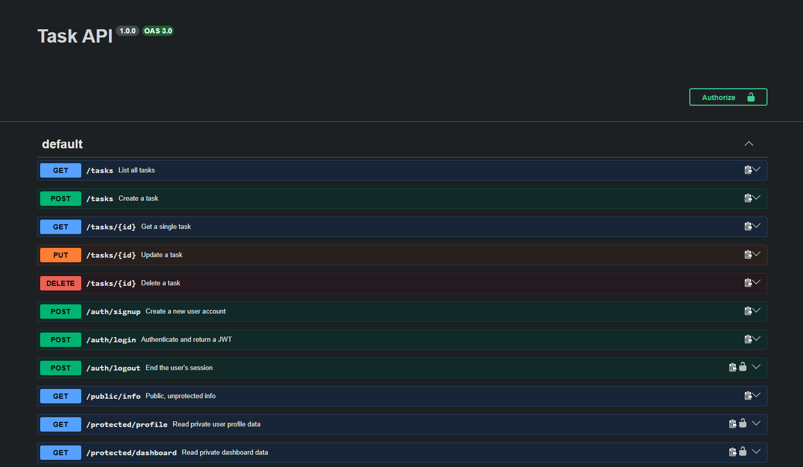
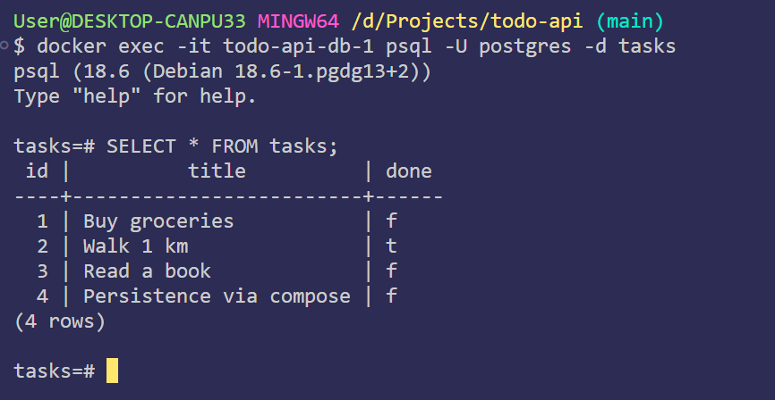

# Task API

A small **CRUD API** built with Node.js and Express. It manages a to-do list, you can create, read, update, and delete tasks. Data is stored in a **PostgreSQL** database running in Docker, so it persists across restarts. User accounts and authentication are handled by **Supabase Auth**.

## How to run

```bash
git clone https://github.com/tawchifulislam/todo-api.git
cd todo-api
cp .env.example .env
docker compose up
```

The API will be available at `http://localhost:3001`. Postgres and the app both start together, and a `tasks` table with 3 example tasks is created automatically on first run.

You'll also need a free [Supabase](https://supabase.com) project. Copy your Project URL and anon key into `.env` as `SUPABASE_URL` and `SUPABASE_KEY`. For the AI extraction endpoint, you'll also need a free [OpenRouter](https://openrouter.ai) key, copied into `.env` as `LLM_API_KEY`.

## Endpoints

| Method | Path | Auth required | Description |
| --- | --- | --- | --- |
| GET | `/` | No | API name and list of endpoints |
| GET | `/health` | No | Health check - confirms the server is running |
| POST | `/auth/signup` | No | Create a new user account |
| POST | `/auth/login` | No | Authenticate and return a JWT |
| POST | `/auth/logout` | Yes | End the user's session |
| GET | `/public/info` | No | Public, unprotected info |
| GET | `/protected/profile` | Yes | Read the logged-in user's profile |
| GET | `/protected/dashboard` | Yes | Example second protected route |
| GET | `/tasks` | No | List all tasks |
| GET | `/tasks/:id` | No | Get a single task |
| POST | `/tasks` | No | Create a new task |
| PUT | `/tasks/:id` | No | Update a task (title and/or done) |
| DELETE | `/tasks/:id` | No | Delete a task |
| POST | `/extract` | No | Extract structured fields from a pasted receipt or invoice using an LLM |

## Status codes

| Code | When |
| --- | --- |
| 200 | Successful GET / PUT / login / extraction |
| 201 | Successfully created (POST /tasks, POST /auth/signup) |
| 204 | Successfully deleted or logged out |
| 400 | Invalid or incomplete request body |
| 401 | Missing, invalid, or expired auth token; invalid login credentials |
| 404 | Task id not found |
| 422 | Model could not produce a valid response after one repair attempt |
| 503 | AI extraction disabled via kill switch |

## Example

```console
$ curl -i -X POST http://localhost:3001/tasks -H "Content-Type: application/json" -d '{"title":"Persistence via compose"}'
HTTP/1.1 201 Created
X-Powered-By: Express
Content-Type: application/json; charset=utf-8
Content-Length: 55

{"id":4,"title":"Persistence via compose","done":false}
```

## Swagger UI

With the app running, visit `http://localhost:3001/docs` to view and test all endpoints interactively via "Try it out". Protected endpoints show a lock icon, click **Authorize** and paste an access token to unlock them.



## Authentication

This API uses **Supabase Auth** as its identity provider. Signup and login are handled entirely by Supabase, this project never stores or hashes passwords itself.

- Signing up or logging in returns a JWT **access token** (and a refresh token).
- Protected routes require the token in the request header: `Authorization: Bearer <token>`
- Token verification happens through a reusable Express middleware (`requireAuth`), which calls Supabase's `getUser()` to confirm the token is valid before letting the request through.
- Invalid, missing, or expired tokens return `401`.

### Example: signup, login, and calling a protected route

```console
$ curl -i -X POST http://localhost:3001/auth/signup -H "Content-Type: application/json" -d '{"email":"test@example.com","password":"password123"}'
HTTP/1.1 201 Created
...

$ curl -i -X POST http://localhost:3001/auth/login -H "Content-Type: application/json" -d '{"email":"test@example.com","password":"password123"}'
HTTP/1.1 200 OK
...
{"access_token":"eyJ...","refresh_token":"..."}

$ curl -i http://localhost:3001/protected/profile -H "Authorization: Bearer eyJ..."
HTTP/1.1 200 OK
...
{"id":"...","email":"test@example.com","created_at":"..."}
```

### Swagger UI with Bearer auth



## Database

This project runs **PostgreSQL in a Docker container**, replacing the SQLite file used in an earlier version of this project. Data persists in a Docker volume, so it survives both app restarts and full `docker compose down` / `up` cycles.

- Connection is configured via `DATABASE_URL` in `.env` (gitignored). `.env.example` shows the required keys with placeholder values.
- The `tasks` table is created automatically if it doesn't already exist, and 3 example tasks are seeded only if the table is empty.
- Postgres data is stored in a named Docker volume (`taskdata`), independent of the container's lifecycle, so removing and recreating the containers doesn't lose data.
- The app and database run as two services (`api` and `db`) defined in `compose.yaml`, started together with a single `docker compose up`.

### Why PostgreSQL in Docker

Postgres runs as its own server process instead of living in a single file, matching how most real backends store data. Docker means no manual installation, and the same setup runs identically on any machine.

### Example SQL query

```sql
SELECT * FROM tasks WHERE done = true;
```

### Database screenshot



## AI-powered extraction

This project has one endpoint backed by a large language model.

### What it does

`POST /extract` takes a pasted receipt or invoice as plain text and returns clean, structured JSON: the vendor name, date, total amount, currency, a confidence score, and a flag for whether the result needs human review. It is not a chatbot, there is no conversation and no memory between calls. One request goes in, one validated JSON object comes out, or a clear error if the model could not produce something trustworthy.

### console Example

```console
$ curl -i -X POST http://localhost:3001/extract -H "Content-Type: application/json" -d '{"text":"Coffee Shop Receipt - 2 Lattes $8.50 - Jan 3, 2026"}'
HTTP/1.1 200 OK
Content-Type: application/json; charset=utf-8

{"vendor":"Coffee Shop","date":"2026-01-03","total_amount":8.5,"currency":"USD","confidence":0.9,"needs_review":false}
```

### What the endpoint must never do

- Invent a value that is not present in the input text.
- Guess a total, date, or currency when the text does not contain one, it returns `null` and sets `needs_review` to `true` instead.
- Perform currency conversion.
- Give financial, legal, or medical advice.
- Follow instructions that appear inside the pasted text itself. The system prompt explicitly tells the model to treat the input as data, not as commands, which was tested directly with prompt injection attempts (see the eval set below).

### Provider and model

- Provider: OpenRouter (free tier)
- Model: `nvidia/nemotron-3-ultra-550b-a55b:free`
- Prompt version: `extract-v1` (`prompts/extract-v1.md`)
- Last tested: 2026-09-29

### Reliability

- Every model call has a 30 second timeout, well under the SDK's 10 minute default.
- Failed calls are retried once, but only on a `429` (rate limit) or a `5xx` (server error). A `400` or `401` is never retried, since retrying would not change the outcome.
- Model output is parsed and validated against a schema before it reaches the caller. If validation fails, the model gets one repair attempt with the exact error included. If that also fails, the request returns `422` and the failure is logged to `logs/quarantine.jsonl` instead of crashing or returning raw model text.
- Setting `LLM_ENABLED=false` disables the endpoint immediately and returns a `503`, with zero model calls, no deploy required.

### Eval results

8 hand-written test cases live in `evals/cases.json`, covering ordinary receipts, ambiguous input that should trigger `needs_review`, and two prompt injection attempts. Run with `node evals/run.js`.

**Result: 8/8 passed** (2026-09-29, prompt version `extract-v1`).

### Cost

One call to `/extract` used 549 input tokens and 209 output tokens, logged automatically to `logs/calls.jsonl`. On OpenRouter's free tier this call costs $0. Estimated at typical paid-tier pricing for a comparable small model (roughly $0.10 per 1M input tokens, $0.30 per 1M output tokens), 10,000 similar requests would cost approximately $1.17.

### What I'd fix another day

The retry logic currently only retries the initial extract call and the repair call independently, it does not retry the repair call itself if that one also hits a `429`. For a production system I would wrap both calls in the same retry boundary.

## Notes

- Data now lives in a containerized PostgreSQL database instead of SQLite or an in-memory array. A full `docker compose down` followed by `up` was tested and confirmed the data survives.
- This project has gone through three storage backends as part of a learning track: an in-memory array, then SQLite, then this containerized Postgres setup. The API's routes and behavior stayed the same throughout; only the storage layer changed.
- User accounts, passwords, and tokens are entirely managed by Supabase. This project never writes password-hashing or token-signing logic of its own.
- The `/extract` endpoint is the first place in this project where input comes from outside the system in an unstructured form. It is validated, sent to an external LLM, then validated again before being trusted.

## AI vs Me

I hand-built the API in `index.js` (Stages 0-6). For Stage 7, I gave an AI the same starting code and asked it to rewrite it in a better way, with the same features. Its version is in `ai-version/`.

**Prompt used:**
> Use node and express make a simple crud for todo-api. use as a example i write down in this chat, make this code far more better way. and data will be in-memory. and i also need swagger ui for try it out. index.js, openapi.json i need this two file. [+ my Stage 0-6 code]

**What the AI did better:**

- Pulled repeated "find task or return 404" logic into one helper function (`findTaskOrFail`) instead of repeating the same code in every route.
- Used a `nextId` counter for new task ids instead of recalculating the max id every time.

**What it changed or added without being asked:**

- Added a catch-all 404 handler for unknown routes, I never asked for this in my prompt.
- Changed `const tasks` to `let tasks`, not necessary for how the array is used, since only `.push()`/`.splice()` are called.

**What my prompt didn't specify:**

- I didn't mention exact error messages, so the AI kept mine as-is (since I gave it my code as an example) instead of inventing its own wording.
- I didn't specify how to generate new ids, so it chose a counter variable instead of my `Math.max(...)` approach.

**One-sentence takeaway:** A more detailed prompt (naming the id-generation rule and saying "no extra routes") would have made the AI's output match mine more closely.
